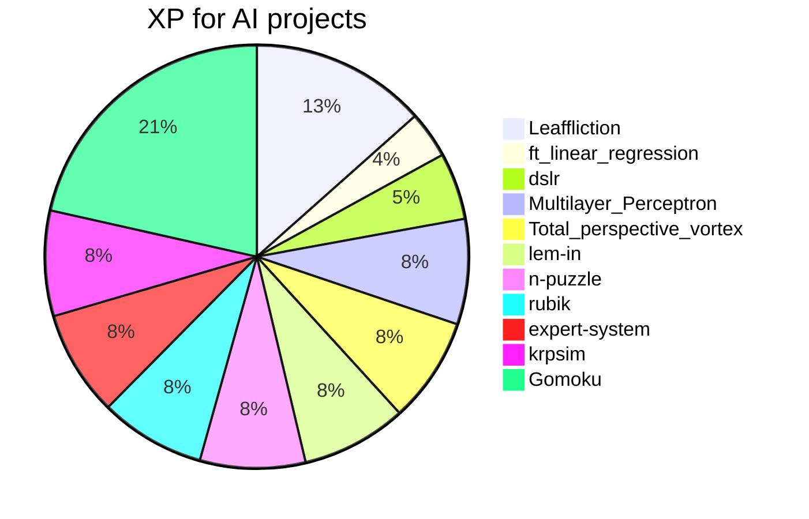
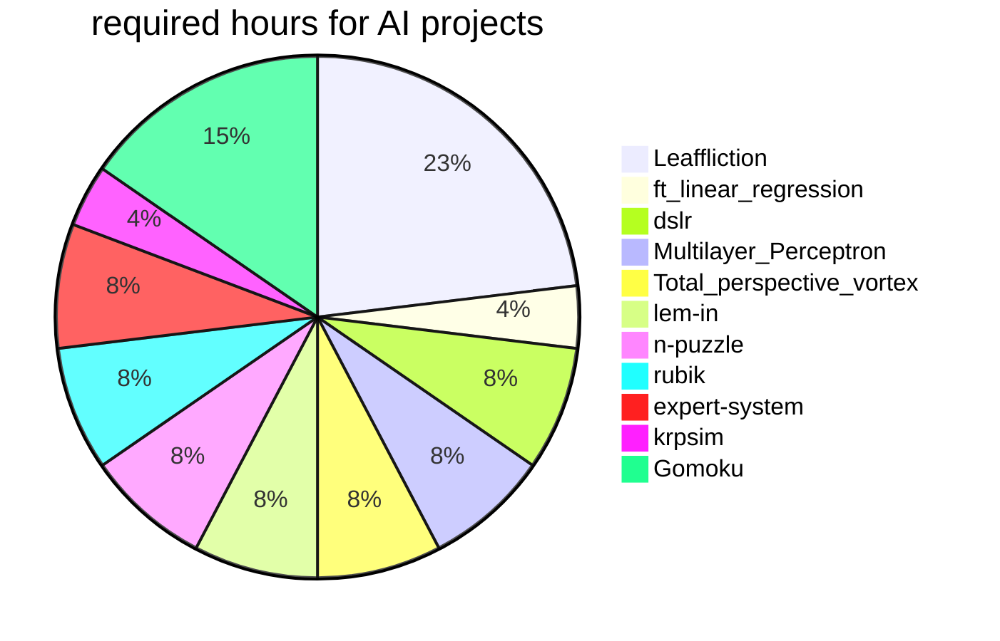
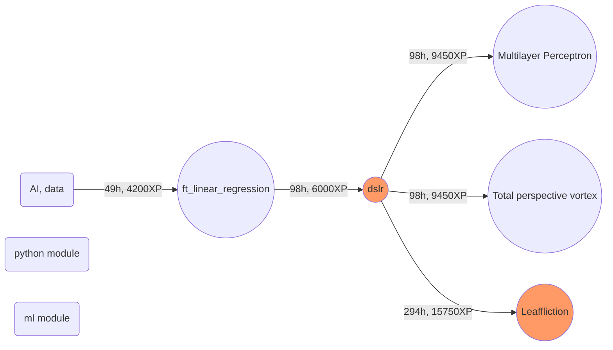
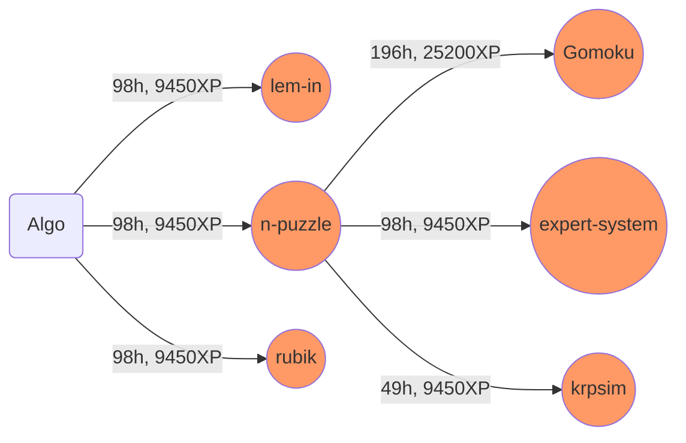

## Algo, AI, data branch

<table>
<tr><th>Title</th><th>Team</th><th>Time</th><th>XP</th><th>Description</th></tr>
<tr><td>[DEPRECATED]ml_module <td>Solo<td>5days<td>15000<td>This is Bootcamp Machine Learning created by the Paris-based student organization 42 AI.</tr>
<tr><td>[DEPRECATED]python_module <td>Solo<td>5days<td>6000<td>This is Bootcamp Python created by the Paris-based student organization 42 AI.</tr>
<tr><td>ft_linear_regression <td>Solo<td>49h<td>4200<td>In this project, you will implement your first machine learning algorithm.</tr>
<tr><td>dslr <td>Group 2<td>98h<td>6000<td>Write a classifier and save Hogwarts!</tr>
<tr><td>Leaffliction <td>Group 2-3<td>294h<td>15750<td>Image classification by disease recognition on leaves.</tr>
<tr>
	<td>Multilayer_Perceptron 
	<td>Solo
	<td>98h
	<td>9450
	<td>This project is an introduction to artificial neural networks, with the implementation of a multilayer perceptron. 
		<a href="https://www.google.com/search?q=artificial neural network" target="_blank">#artificial neural network</a>
		<a href="https://www.google.com/search?q=feedforward" target="_blank">#feedforward</a>
		<a href="https://www.google.com/search?q=backpropagation" target="_blank">#backpropagation</a>
		<a href="https://www.google.com/search?q=gradient descent" target="_blank">#gradient descent</a>
		<a href="https://www.google.com/search?q=softmax function" target="_blank">#softmax function</a>
		<a href="https://en.wikipedia.org/wiki/Cross_entropy#Cross-entropy_error_function_and_logistic_regression" target="_blank">#binary cross-entropy error function</a>
		<a href="https://en.wikipedia.org/wiki/Early_stopping" target="_blank">#early stopping</a>
</tr>
<tr>
	<td>Total_perspective_vortex</td>
	<td>Solo</td>
	<td>98h</td>
	<td>9450</td>
	<td>Brain computer interface with machine learning based on electroencephalographic data.  
		<a href="https://www.google.com/search?q=python MNE" target="_blank">#python MNE</a>
		<a href="https://www.google.com/search?q=EEG" target="_blank">#EEG</a>
		<a href="https://www.google.com/search?q=dimensionality reduction" target="_blank">#dimensionality reduction</a>
		<a href="https://www.google.com/search?q=scikit-learn pipeline" target="_blank">#scikit-learn pipeline</a>
	</td>
</tr><tr><td>lem-in <td>Group 2<td>98h<td>9450<td>This project is meant to make you code an ant farm manager.</tr>
<tr><td>n-puzzle <td>Group 2<td>98h<td>9450<td>The goal of this project is to programmatically solve the N-puzzle.</tr>
<tr><td>rubik <td>Group 2<td>98h<td>9450<td>This project will make you write a program that solves Rubik’s Cubes with minimum spins.</tr>
<tr><td>expert-system <td>Group 2<td>98h<td>9450<td>The goal of this project is to make a propositional calculus expert system.</tr>
<tr><td>krpsim <td>Group 2-3<td>49h<td>9450<td>This project may be an algorithmic project, an operational research project, an AI project as well as an industrial project... As you like.</tr>
<tr><td>Gomoku <td>Group 2<td>196h<td>25200<td>The goal of this project is to make an AI capable of beating human players at Gomoku.</tr>
</table>

### AI, data branch

### Algo branch

